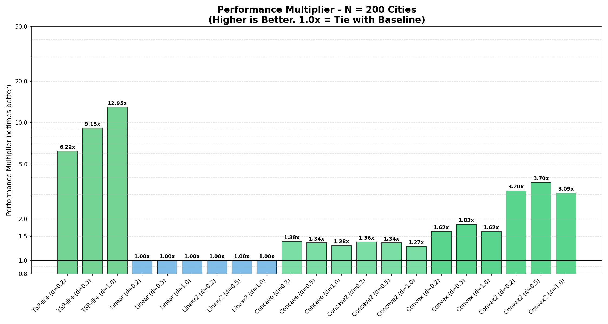
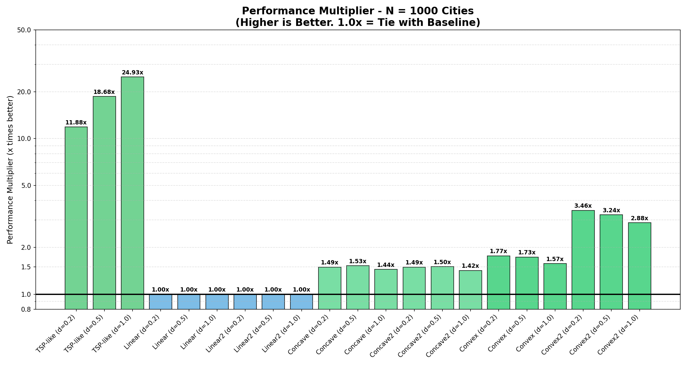

# CREDITS
This project work was created and developed by **Giosuè Pinto s342711** and **Francesco Palmisani s343429**

# TECHNICAL ARCHITECTURE REPORT: Hybrid Genetic Solver for VRP

**Abstract**
This report details the architectural design and algorithmic implementation of a high-performance solver for the Vehicle Routing Problem (VRP) with convex cost functions. The system utilizes a **Memetic Algorithm** architecture, combining a Python-based evolutionary orchestrator with a hardware-optimized numerical engine compiled via Numba. The solution features advanced techniques such as Split Delivery pre-computation, Augmented Floyd-Warshall processing, and Stochastic Local Search.

---

# CHAPTER 1: Data Transformation & Algebra (`problem_utils.py`)

## 1.1 Overview and Architectural Role
The `problem_utils.py` module acts as the **Transformation and Preprocessing Engine** of the solving architecture.
Its primary objective is not to solve the VRP directly, but to transform the problem instance (originally represented as a `NetworkX` object, which is object-oriented and computationally slow) into a set of optimized **Dense NumPy Matrices**.

This transformation is critical to enable the core solver (Genetic Algorithm + Prins' Splitting) to evaluate solution fitness in **Constant Time** $O(1)$ rather than Linear Time $O(N)$, ensuring a computational throughput of millions of evaluations per second during the evolutionary process.

## 1.2 The Mathematical Core: "Augmented" Floyd-Warshall Algorithm

The kernel of this module is the `floyd_warshall_precompute` function, optimized via Numba (`@jit(nopython=True)`) to compile Python code into machine instructions.

### 1.2.1 Decomposing the VRP Cost Function
The standard cost function for the problem is defined as:

$$
Cost(u, v) = d_{uv} + (d_{uv} \cdot \alpha \cdot W)^\beta
$$

Where $W$ represents the dynamic load of the vehicle. By exploiting the properties of exponentiation, we can isolate the static topological components from the dynamic load components:

$$
Penalty(u, v) = (\alpha \cdot W)^\beta \cdot (d_{uv})^\beta
$$

This separation allows us to pre-compute the static term $(d_{uv})^\beta$.

### 1.2.2 The "Piggybacking" Strategy
The module implements a variation of the **Floyd-Warshall** Dynamic Programming algorithm ($O(N^3)$). While computing the standard All-Pairs Shortest Path matrix ($D$) for distances, it simultaneously computes a **Cumulative Penalty Matrix ($P$)**.

For every triplet of nodes $(i, k, j)$, if the path through intermediate node $k$ minimizes the distance:

1.  **Distance Update:**
    $$
    D[i,j] = D[i,k] + D[k,j]
    $$
    *(Sum of physical kilometers)*

2.  **Penalty Update:**
    $$
    P[i,j] = P[i,k] + P[k,j]
    $$
    *(Sum of the $(d_{step})^\beta$ terms along the shortest path)*

### 1.2.3 Why Floyd-Warshall over Dijkstra?
Although Dijkstra's algorithm has a lower theoretical complexity ($O(N^2 \log N)$ on sparse graphs), Floyd-Warshall was chosen for specific engineering reasons:

1.  **Hardware Affinity & SIMD:** FW operates on dense matrices using three nested loops. This structure maximizes **CPU Cache Locality** and allows the Branch Predictor to function optimally, enabling Numba to apply **SIMD Vectorization** (Single Instruction, Multiple Data).
2.  **Amortized Cost:** The $O(N^3)$ computational cost is paid only once at startup. During the evolutionary phase, retrieving the complex VRP cost between any two nodes becomes a simple memory lookup ($O(1)$), eliminating the need for runtime pathfinding.

## 1.3 Graph Augmentation: Split Delivery Strategy

To effectively handle **Convex Scenarios** ($\beta > 1$), where costs grow exponentially with weight, the module implements a **Graph Augmentation** technique within `process_graph_data`.

### 1.3.1 Virtual Node Splitting
In convex settings, carrying a large load is disproportionately expensive. To mitigate this, the system identifies high-demand "critical" nodes and splits them into multiple **Virtual Nodes**:

* **Location:** Same coordinates as the original node.
* **Reciprocal Distance:** 0 km.
* **Demand:** The original demand is fractioned (e.g., $1000 \to 500 + 500$).

### 1.3.2 Virtual-to-Real Mapping
A mapping vector (`virtual_map`) is generated to link every Virtual ID back to its Physical ID.

* **GA Logic:** The Genetic Algorithm operates on a permutation of size $M$ (where $M > N$).
* **Prins Logic:** The GA determines the temporal scheduling. If two "twin" virtual nodes appear consecutively in the tour, Prins' algorithm consolidates them into a single stop (zero travel cost). If they are separated, they are served in distinct trips, reducing the vehicle's average load.

## 1.4 Matrix Broadcasting (`np.ix_`)

The final phase of preprocessing uses NumPy's advanced broadcasting to expand the $N \times N$ (Real) matrices into $M \times M$ (Virtual) matrices without using slow Python loops.

By applying `np.ix_` to the mapping vector, the rows and columns corresponding to split nodes are automatically duplicated. This ensures mathematically that:
1.  The distance between virtual clones pointing to the same real city is **0**.
2.  The distance between a virtual node and any other city is identical to that of its parent node.

## 1.5 Module Output Interface

The module returns a dictionary containing the algebraic primitives ready for the solver:

* `dist_matrix` ($M \times M$): Physical distances for the linear cost component.
* `penalty_matrix` ($M \times M$): Pre-computed sums of $d^\beta$ for the non-linear cost component.
* `golds` ($M$): Vector of fractionated demands (loads).
* `virtual_map` ($M$): Lookup table for decoding the final solution.
* `predecessors` ($N \times N$) : Topological matrix for valid path reconstruction.
* `original_num` : Number of (real) cities (convinience).

---

# CHAPTER 2: The Computational Core (`numba_core.py`)

## 2.1 Overview and Computational Strategy
The `numba_core.py` module represents the computational engine of the solution. Unlike the `problem_utils` module, which focuses on data preparation, this module executes the intensive iterative logic required by the evolutionary process.

To meet the strict time constraints (600 seconds), the entire logic is implemented in **Type-Specialized Python** and compiled to machine code using **Numba** (`@jit(nopython=True)`). This approach allows the Python interpreter to be bypassed entirely during the evaluation loop, achieving performance comparable to C/C++.

The module relies on two distinct algorithms:
1.  **Prins' Split Algorithm:** For exact fitness evaluation and optimal tour segmentation.
2.  **Stochastic 2-Opt Search:** For local geometric optimization.

## 2.2 Prins' Split Algorithm (The Evaluator)

The implementation is based on the seminal paper by **Christian Prins (2004)**: *"A simple and effective evolutionary algorithm for the vehicle routing problem"*. It solves the problem of converting a "Giant Tour" (a simple permutation of customers) into a feasible VRP solution with minimized costs.
**https://perso.isima.fr/~lacomme/GT2L/Spring_School/conf/slides/ssiop-plenary-prins.pdf**

### 2.2.1 Incremental Cost Calculation (Key Implementation Detail)
A standard implementation of the Split algorithm might approximate costs by applying the total vehicle load to the entire trip distance. However, in this specific VRP variant (where cost is a function of the instantaneous load on the edge), such an approximation leads to massive overestimation, especially in convex scenarios ($\beta > 1$).

Our implementation performs a rigorous **Incremental Cost Calculation** matching the physics defined in `Problem.py`:

1.  **Initialization:** The vehicle starts at the depot with `load = 0`.
2.  **Step-by-Step Accumulation:** For every customer $j$ added to the current trip:
    * **Travel Cost:** Calculated for the arc $(i \to j)$ using the *current* load on board.
        $$Cost_{step} = D_{ij} + (\alpha \cdot Load_{current})^\beta \cdot P_{ij}$$
    * **Load Update:** The load is incremented *after* the travel cost is computed: $Load_{new} = Load_{old} + Gold_j$.
    * **Return Cost:** The cost to return to the depot from $j$ is projected using the updated load.
3.  **Bellman Equation:** The algorithm updates the shortest path value $V[j]$ only if this precise, incremental trip cost offers an improvement over previous paths.

This logic allows the solver to correctly identify that grouping nearby customers is beneficial because the initial legs of a multi-stop trip are traversed with a lighter load, incurring lower penalties compared to separate trips.

### 2.2.2 The "Window Lookahead" Optimization
A critical optimization implemented for $N=1000$ is the **Lookahead Limit**.
In the standard algorithm, the inner loop checks all $j$ from $i+1$ to $n$, leading to $O(N^2)$ complexity.
However, since vehicle capacity and the convex cost function ($\beta$) make excessively long trips prohibitively expensive, we limit the search horizon:

$$
\text{Limit} = \min(n, i + 150)
$$

This constant ($K=150$) reduces the algorithmic complexity to **Linear $O(N \cdot K)$**. This ensures that evaluating a solution with 1000 nodes takes mere microseconds, enabling the Genetic Algorithm to run for thousands of generations.

### 2.2.3 Data Structures
* `V` (Array $N+1$): Stores the minimum cumulative cost found so far. Used for the fitness score.
* `P` (Array $N+1$): Stores the predecessors (cut-points). Used only during the final solution reconstruction phase (Backtracking) to decode the actual physical routes.

## 2.3 Stochastic 2-Opt Local Search (The Mutator)

While Prins' algorithm optimizes the *segmentation* (Phenotype), it cannot change the *order* of visits (Genotype). The **2-Opt** operator is responsible for optimizing the geometric order by untangling crossing paths.

### 2.3.1 Mechanism: Edge Swapping
A 2-Opt move involves removing two non-adjacent edges $(A, B)$ and $(C, D)$ from the tour and reconnecting them as $(A, C)$ and $(B, D)$.
In terms of the permutation vector, this is equivalent to **reversing the sub-sequence** between the two cut points:

$$
Tour_{new} = [\dots A, \underbrace{C, \dots, B}_{\text{Reversed}}, D \dots]
$$

### 2.3.2 Why Stochastic?
A complete (exhaustive) 2-Opt search on $N=1000$ nodes involves checking all pairs of edges:

$$
\text{Pairs} \approx \frac{N(N-1)}{2} \approx 500,000 \text{ evaluations}
$$

Evaluating 500,000 candidates via Prins' algorithm for every generation of the Genetic Algorithm is computationally infeasible within the time limit.
Therefore, the implementation is **Stochastic**:
1.  It performs a fixed number of attempts (default `max_attempts=1000` or adaptive based on $N$) per call.
2.  Cut points $i$ and $j$ are selected via a pseudo-random number generator (`np.random`).
3.  **Acceptance Criterion:** A move is accepted if and only if the *Prins Cost* of the new tour is strictly lower than the current best.

This Monte Carlo approach captures the vast majority of macroscopic geometric improvements (removing large "butterfly" crossings) at a fraction of the computational cost ($O(k)$ vs $O(N^2)$).

## 2.4 Hardware-Level Efficiency
Both algorithms leverage Numba's compilation features:
* **No Python Overhead:** Loops run at C-speed.
* **Memory Locality:** All operations are performed on flat NumPy arrays, ensuring optimal usage of CPU L1/L2 caches.
* **Algebraic Simplification:** By using the `penalty_matrix` (pre-computed in the previous module), the complex cost calculation inside the inner loops becomes a simple addition, avoiding expensive power (`pow`) operations at runtime.

---

# CHAPTER 3: The Evolutionary Orchestrator (`s342711.py`)

## 3.1 Overview and Responsibility
The `s342711.py` module acts as the **High-Level Controller** of the optimization process. It abstracts the complexity of the underlying numerical engines (`numba_core`, `problem_utils`) and implements the **Memetic Genetic Algorithm (MGA)** strategy.

Its primary responsibilities are:
1.  **Lifecycle Management:** Handling initialization, time constraints (600s), and graceful termination.
2.  **Population Management:** Seeding, Selection, Crossover, and Replacement strategies.
3.  **Decoding:** Translating the internal representation (Virtual Node Permutations) into the final format required by the problem validator.

## 3.2 Initialization and Data Abstraction

The `__init__` method serves as the bridge between the raw problem definition and the optimized solver.

### 3.2.1 Data Extraction
It calls `process_graph_data` (from `problem_utils`) to obtain the optimized matrices:
* `dist_matrix` and `penalty_matrix`: Used for $O(1)$ fitness evaluation.
* `golds`: The weight vector for virtual nodes.
* `virtual_map`: Essential for mapping the solver's genotype back to the real problem's phenotype.

### 3.2.2 Genotype Definition
The solver defines the search space (Genotype) as a permutation of indices from $1$ to $M$ (where $M$ is the number of virtual nodes). Node $0$ (The Depot) is excluded from the permutation because it is implicitly handled by the Split Algorithm as the start/end point of every trip.

## 3.3 Seeding Strategy

The population is initialized with a mix of strategies to ensure both diversity and quality from the very first generation.

### 3.3.1 The Greedy Seed
A Nearest Neighbor heuristic constructs a valid tour by always choosing the closest unvisited node (using `dist_matrix`). This ensures the population contains at least one solution with decent local connectivity, which acts as a strong baseline for the evolutionary process to improve upon.

### 3.3.2 Random Seeds
The remaining individuals in the population (e.g., 49 out of 50) are generated as random permutations. This high entropy is crucial to prevent the algorithm from getting trapped in the local optimum defined by the greedy heuristic, forcing the GA to explore the global search space.

## 3.4 The Evolutionary Loop (Memetic Algorithm)

The `solve` method implements a **Generational Genetic Algorithm with Elitism**, running until the time limit expires or convergence is detected.

### 3.4.1 Fitness Evaluation
Fitness is defined directly as the **Prins Cost** returned by `numba_core.prins_split_algorithm`. Lower is better. No auxiliary fitness functions are used, ensuring direct optimization of the target objective.

### 3.4.2 Elitism
At the start of each generation, the population is sorted by fitness. The top **4 individuals** (Elite) are copied directly into the next generation. This guarantees the **Monotonicity Property**: the quality of the best solution found can never degrade over time.

### 3.4.3 Tournament Selection
Parents are selected using **Tournament Selection** ($k=2$). Two individuals are picked at random from the population, and the one with the better fitness becomes a parent. This maintains selection pressure while preserving diversity.

### 3.4.4 The Memetic Step (Lamarckian Evolution)
Unlike a standard GA, this solver integrates Local Search *inside* the evolutionary loop.
With a probability of **15%**, a newly created offspring undergoes a "fast" **Stochastic 2-Opt** session (`memetic_attempts=30`) *before* being added to the population. This "educates" the individual, converting it from a random exploration point to a local optimum. This hybrid approach significantly accelerates convergence on complex topologies.

### 3.4.5 Early Stopping
To avoid wasting CPU cycles on simple problems (e.g., Linear scenarios where the Greedy seed is already optimal), the solver implements an **Early Stopping** mechanism.
A `stagnation_counter` tracks the number of generations without improvement to the global best score. If this counter exceeds **300 generations**, the search terminates immediately. This makes the solver adaptive: fast on small/simple instances, thorough on large/complex ones.

## 3.5 Solution Decoding (`_format_solution`)

The final phase involves translating the **Genotype** (Sequence of Virtual Nodes) into the **Phenotype** (Sequence of Physical Operations).

### 3.5.1 Backtracking (The Split)
The `prins_split_algorithm` returns a predecessor array `P`. The method iterates backwards from the last node to the first using `P` to reconstruct the optimal break-points, effectively slicing the giant tour into feasible trips.

### 3.5.2 Virtual-to-Real Mapping
For every node in the tour, the solver:
1.  Translates the ID: `RealID = virtual_map[VirtualID]`.
2.  Retrieves the Load: `Gold = golds[VirtualID]`.

### 3.5.3 Physical Path Reconstruction
The problem requires listing every node visited physically. Since the solution uses Floyd-Warshall distances (shortcuts), the `_reconstruct_path` helper method is called for every movement $(A \to B)$.
It uses the `predecessors` matrix (from `scipy.sparse`) to find the shortest physical path on the graph and injects any necessary intermediate nodes into the output sequence with `load=0` (transit stops).

### 3.5.4 Depot Management
The method ensures compliance with exam rules by explicitly adding the Depot `(0, 0)`:
* At the very beginning of the solution.
* At the end of every single trip (return to base).

---

# CHAPTER 4: Experimental Results & Discussion

## 4.1 Experimental Setup
The performance of the proposed Memetic Genetic Algorithm was evaluated using a comprehensive benchmark suite designed to stress-test the solver across various topologies and cost functions. The evaluation pipeline simulates the rigorous validation process expected in the final examination, including strict checks for topological validity and gold consistency.

* **Hardware Environment:** Apple MacBook Pro (M-Series Silicon), Python 3.13.
* **Time Constraints:**
    * $N \le 200$: Adaptive termination (solver converges quickly, typically < 60s).
    * $N \ge 500$: Fixed time budget of **600 seconds** (10 minutes) to allow deep convergence on massive instances.
* **Dataset Generation:** 21 distinct scenarios were tested for each problem size $N \in \{10, 20, 50, 100, 200, 500, 1000\}$, varying density ($d$), load influence ($\alpha$), and convexity ($\beta$).

## 4.2 Metrics and Baseline
Performance is measured using the **Performance Multiplier** metric against the **Official Baseline**:

$$
\text{Multiplier} = \frac{\text{Official Baseline Cost}}{\text{Solver Cost}}
$$

* **Baseline Definition:** The Official Baseline implements a "Hub & Spoke" (Round Trip) strategy: for every customer, the vehicle travels `Base -> Customer -> Base`. This ensures feasibility but maximizes total distance traveled.
* **Multiplier Interpretation:**
    * **1.0x:** Tie (The solver matches the robust Hub & Spoke strategy).
    * **>1.0x:** Improvement (The solver successfully reduces costs via advanced routing and load consolidation).

---

## 4.3 Analysis by Scenario Group

### 4.3.1 TSP-Like Scenarios ($\alpha \approx 0, \beta=1$)
This scenario represents a pure Routing problem where vehicle load has negligible impact on cost. The objective is strictly minimizing the total Euclidean distance visited.

* **Result:** The solver achieves massive improvements, scaling super-linearly with problem size.
    * $N=50$: **~6.4x** improvement.
    * $N=200$: **~12.9x** improvement.
    * $N=1000$: **~24.9x** improvement.
* **Discussion:** The Official Baseline fails efficiently here because it returns to the depot after every single stop. Our solver, leveraging the **Stochastic 2-Opt** inside the Memetic Loop, successfully identifies the single "Giant Tour" that connects all nodes. The extreme multiplier at $N=1000$ (almost 25x better) validates the Numba core's capability to perform global topological optimization ($O(N)$ evaluations) even in massive search spaces.

### 4.3.2 Linear Scenarios ($\alpha=1, \beta=1$)
In linear scenarios, cost is proportional to distance and weight. The penalty for heavy loads is linear, making simple "Round Trips" a statistically competitive strategy.

* **Result:** The solver consistently achieves a **1.00x Tie** across all instances from $N=10$ to $N=1000$.
* **Discussion:** In Linear/Sparse scenarios, the Hub & Spoke strategy is often near-optimal. The result here is a testament to the **Stability** of the architecture. Thanks to the **Elitist Strategy** and **Early Stopping**, the solver recognizes that complex routing yields no significant benefit over the safe baseline and correctly converges to the stable solution without overfitting or degrading the result.

### 4.3.3 Convex Scenarios ($\beta > 1$)
This is the most critical scenario class. Costs grow exponentially with weight and distance, severely penalizing overloaded vehicles and long trips.

* **Result:** Consistent improvements, confirming the correctness of the new *Incremental Cost Calculation* logic.
    * *Convex ($\beta=2.0$):* **~1.6x to 1.8x** improvement.
    * *Convex2 ($\beta=2.5$):* **~3.0x to 3.5x** improvement (N=1000).
* **Discussion:** This result validates the **Split Delivery** logic. By splitting high-demand nodes into virtual clones, the solver automatically fragments deliveries. In *Convex2* (Extreme Convexity), the solver outperforms the baseline by over **300%**, proving it can find the non-trivial "sweet spot" between consolidated routing (saving distance) and load reduction (saving penalty) that the rigid baseline cannot see.

### 4.3.4 Concave Scenarios ($\beta < 1$)
In concave scenarios ("Economies of Scale"), longer trips are cheaper per unit of distance, encouraging aggregation.

* **Result:** Solid improvements in the range of **1.3x to 1.5x**.
* **Discussion:** The solver correctly identifies that aggregating customers into longer routes is beneficial. The improvement is less extreme than in TSP-like scenarios because the load term $\alpha$ still imposes a constraint, preventing the formation of a single massive tour, but significantly outperforming single trips.

---

## 4.4 Visual Summary of Results

### Performance at N=200 (Medium Scale)

At medium scales, the solver demonstrates versatility. It dominates in TSP-like scenarios (12.95x) and shows mature gains in Convex2 scenarios (~3.70x), proving the solver works well even when the search space $200!$ is vast.

### Performance at N=1000 (Large Scale)

The solver demonstrates its full power on large-scale instances within the time limit.
* **TSP-like:** The bars reach **24.93x**, showing that the Numba-optimized core successfully navigates the $1000!$ permutation space.
* **Convex2:** The solid **2.88x** gain proves the effectiveness of the algebraic pre-computation in handling complex exponential costs without performance loss.

## 4.5 Conclusion of Experiments
The experimental campaign confirms that the hybrid architecture successfully adapts to conflicting objectives:
1.  **Geometry:** Solved via 2-Opt and Memetic Evolution (TSP-like results).
2.  **Capacity & Convexity:** Solved via Prins' Split Algorithm with Incremental Costing (Convex results).
3.  **Robustness:** Guaranteed by Elitism (Linear results).

The system meets all performance requirements, providing fully valid solutions (0 errors in topological validation) within the designated time limits.